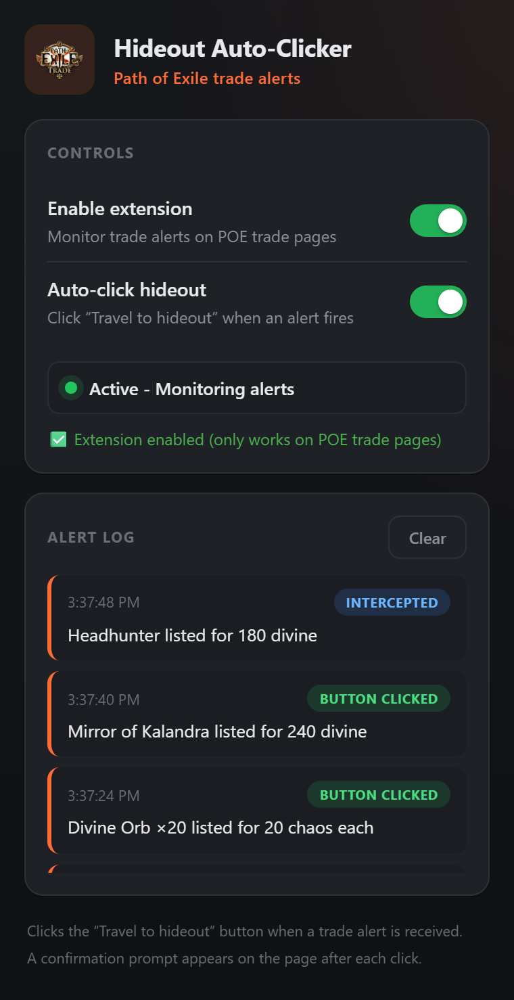
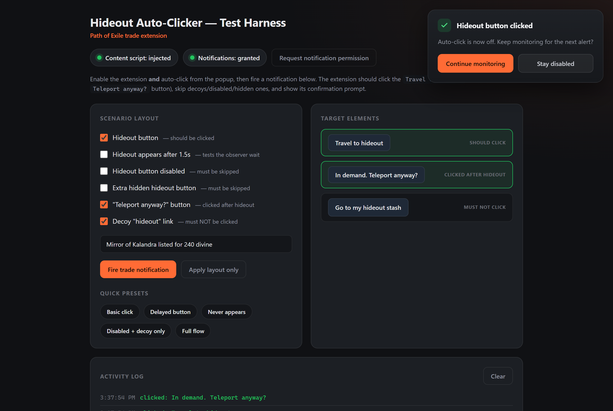

# POE Trade Alert Auto-Clicker

A Chrome/Edge extension for **Path of Exile** trade. When a live-search trade
alert fires, it automatically clicks the **"Travel to hideout"** button so you
never miss a listing — then shows an on-page confirmation before it does it
again.

<p align="center">
  
  
</p>

## Features

- **Alert monitoring** — intercepts the browser notifications POE trade fires on new listings.
- **Auto-click** — clicks "Travel to hideout" (and a follow-up "Teleport anyway?") the moment an alert lands.
- **Safe by design** — after each click auto-click switches off and asks you to confirm before continuing, so it never spams teleports.
- **Precise matching** — only the real hideout button is clicked; decoy links, disabled and hidden buttons are skipped.
- **Alert log** — every intercepted alert with a timestamp and what happened.
- **Local only** — no servers, no tracking, no network requests.

## Install

### From a release (recommended)

1. Go to the [**Releases**](../../releases) page and download the latest `poe-trade-alert-<version>.zip`.
2. **Unzip** it to a permanent folder (e.g. `C:\Tools\poe-trade-alert`). Don't delete this folder later — Chrome loads the extension from it every launch.
3. Open `chrome://extensions` (or `edge://extensions`).
4. Turn on **Developer mode** (top-right toggle).
5. Click **Load unpacked** and select the unzipped folder.
6. *(Optional)* Click the puzzle-piece icon in the toolbar and **pin** "Hideout Auto-Clicker" so it stays visible.

> **Why unpacked?** Chrome blocks self-hosted `.crx` installs on Windows/macOS,
> so a downloaded zip loaded via Developer mode is the supported way to install
> outside the Web Store. Updating = download the new zip, replace the folder
> contents, and hit the refresh icon on the extension card.

## Usage

1. Open your live search on `https://www.pathofexile.com/trade`.
2. Click the extension icon and turn on **both** toggles:
   - **Enable extension** — starts monitoring the trade page.
   - **Auto-click hideout** — lets it click the button for you.
3. Leave the tab open. When an alert fires the extension:
   - clicks **Travel to hideout** (and **Teleport anyway?** if the whisper is in demand),
   - logs the alert in the popup,
   - shows an on-page prompt: **Continue monitoring** or **Stay disabled**.
4. Click **Continue monitoring** to arm it for the next alert.

The confirmation step is deliberate — it stops a burst of alerts from
teleporting you around repeatedly.

### Popup controls

| Control | What it does |
| --- | --- |
| **Enable extension** | Master on/off. Monitors POE trade tabs. |
| **Auto-click hideout** | Clicks the hideout button when an alert fires. |
| **Status** | Green = actively monitoring. |
| **Alert log** | Recent alerts with timestamp + outcome badge. |
| **Clear** | Empties the log. |

## How it works

1. **`inject.js`** runs in the page and wraps the `Notification` API with a `Proxy` so it can see every trade alert the site raises.
2. **`content.js`** receives those alerts, uses a `MutationObserver` to wait for the "Travel to hideout" button, clicks it, then shows the confirmation prompt.
3. **`background.js`** (MV3 service worker) holds state in `chrome.storage.local`, keeps the alert history, and injects the scripts into trade tabs.
4. **`popup.*`** is the UI: toggles, status and the alert log.

```
alert fires → intercepted → logged → (if enabled) click hideout
   → click "teleport anyway?" → auto-click off → confirmation prompt
```

## Development

```bash
npm install
npx playwright install chromium   # one-time browser download

npm test              # headless E2E (Playwright loads the unpacked extension)
npm run test:headed   # watch it run in a visible browser
npm run launch        # open a real browser with the interactive test harness
npm run screenshots   # regenerate docs/screenshots/*.png
```

The E2E tests and the harness serve `tests/fixtures/` in place of the real
trade page (via request interception), so the extension injects and behaves
exactly as it would on `pathofexile.com/trade`.

### Building a release

Pushing a Conventional Commit (`feat:` / `fix:`) to `master` triggers
`.github/workflows/release.yml`, which bumps the version, packages a clean zip
(only the files the extension loads, with `manifest.json` version synced), and
publishes a **pre-release**. Run the **Promote Release** workflow to flip the
latest pre-release to a stable release.

### Debugging

- **Content script** — open the trade page, F12, look for `[POE Extension]` logs.
- **Service worker** — `chrome://extensions` → the extension's "service worker" link.
- **Popup** — right-click the icon → Inspect popup.

After editing code, hit the refresh icon on the extension card and reload any
open trade tabs.

## File structure

```
poe-live-trade-extension/
├── manifest.json          # MV3 extension config
├── background.js          # Service worker (state, history, injection)
├── content.js             # Alert handling + auto-click + confirmation
├── inject.js              # Page-context Notification interceptor
├── popup.html/.css/.js    # Toolbar popup UI
├── PoeLogo.png, icon*.png # Icons
├── scripts/               # launch.js, screenshots.js
├── tests/                 # Playwright E2E + fixtures/harness
├── docs/screenshots/      # README images
└── .github/workflows/     # Release pipeline
```

## Security & privacy

- Runs only on `pathofexile.com/trade` pages (and the local test fixture).
- No data leaves your machine; no external network requests.
- State stored locally in `chrome.storage.local`.
- Fully open source — read every file before installing.

## Limitations

- Chromium browsers only (Chrome, Edge, Brave, …).
- Confirmation required after each auto-click (by design).
- Button matching is text-based ("travel to hideout").
- Alert history capped at 20 entries.

## Version history

### v1.2.0
- Added GitHub Actions release pipeline (clean, Web-Store-ready zip) and Promote Release workflow.
- Documented install-from-zip flow; added popup + confirmation screenshots.

### v1.1.0
- Persisted state in `chrome.storage.local` (survives MV3 worker restarts).
- Read state per-message (no stale globals); fixed init race.
- Single global auto-click state (no per-tab key leak).
- Tightened button matching to "travel to hideout".
- Replaced polling with a `MutationObserver`.
- Rewrote the page interceptor as a `Proxy` (preserves prototype, statics, `instanceof`).
- Fixed dangling message ports; removed unused `notifications` permission; narrowed `web_accessible_resources`.

### v1.0.0
- Initial release: alert interception, auto-click, confirmation dialog, logging, test page.

## License

Free to use and modify for personal use.
